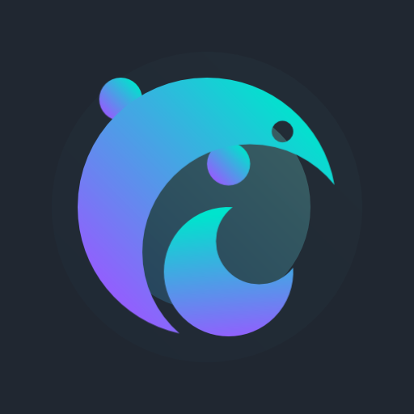
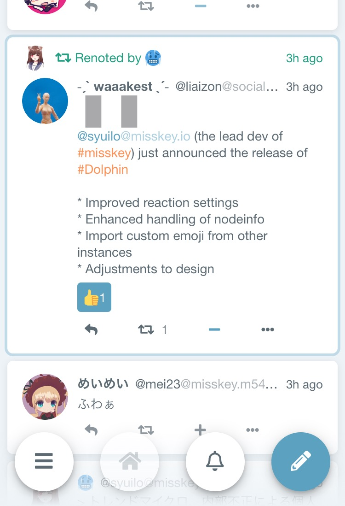
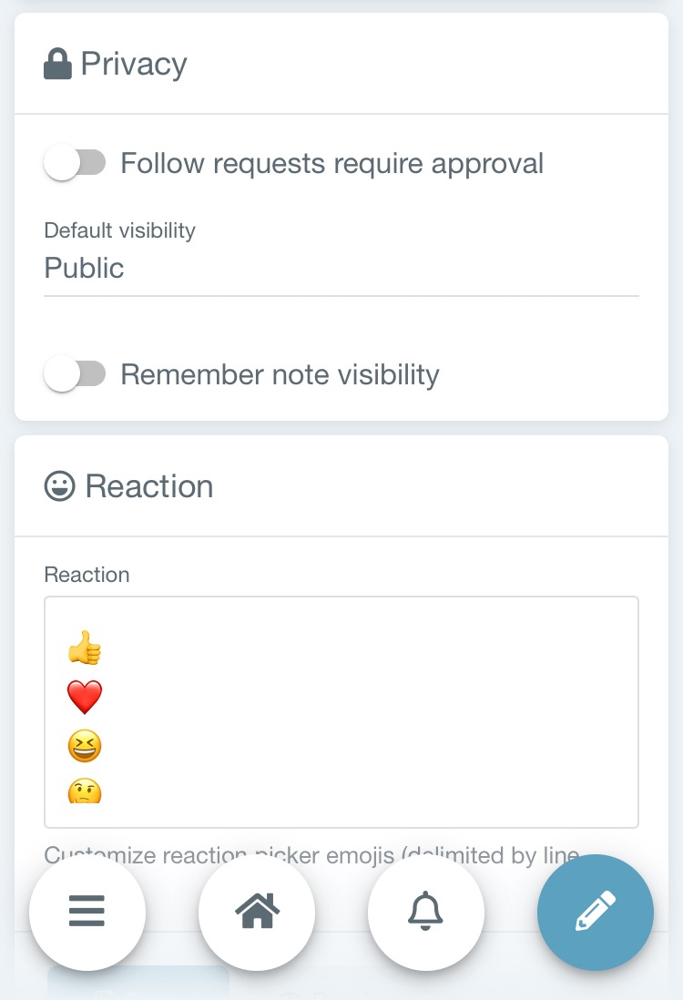
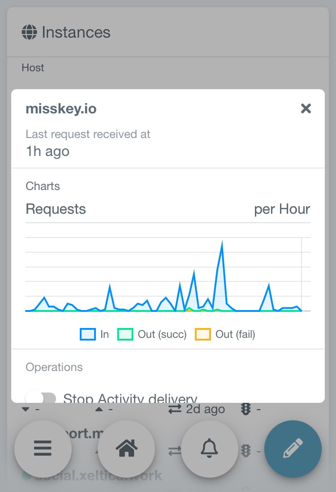
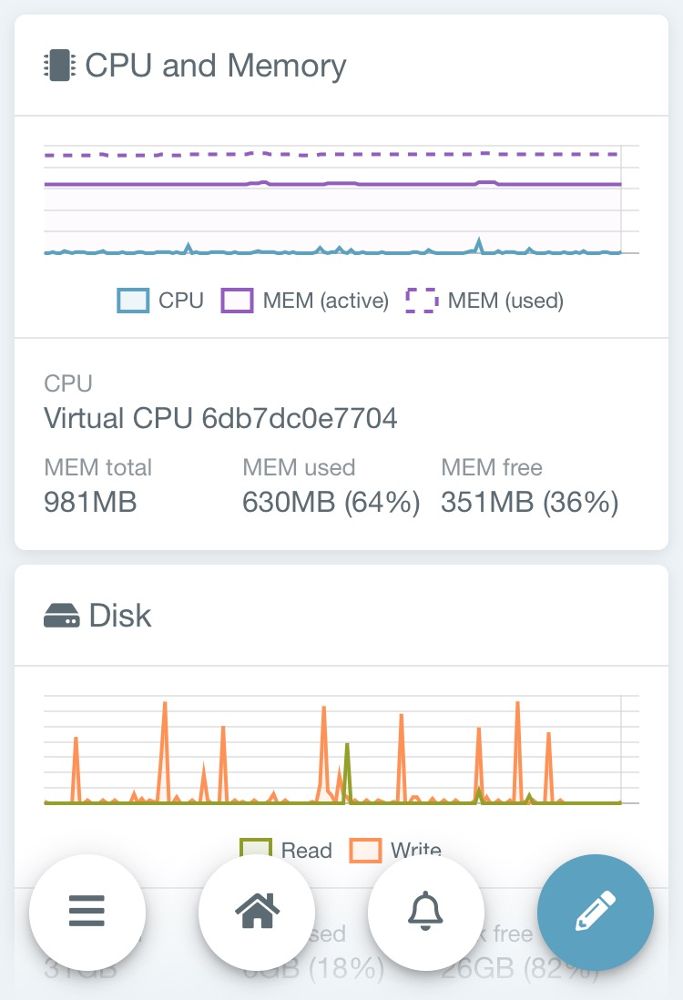
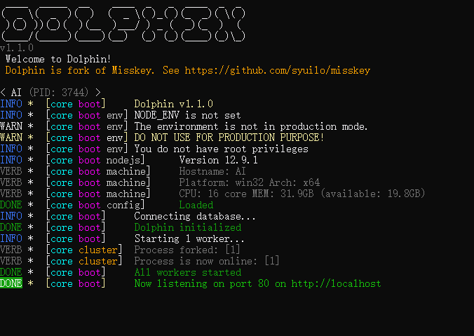

<p align="center"></p>

<div>
<h1 align="center">Dolphin</h1>
<p align="center">Dolphin is a lightweight ActivityPub server optimized for single user  (or few users) use.</p>
</div>

<p align="center"><a href="https://www.patreon.com/syuilo"></a></p>

## 🍀 Why Dolphin
Dolphin is a fork of [Misskey](https://github.com/syuilo/misskey) and a sister project of it.
While inheriting features such as reaction and high performance, it has been optimized for single-user use. As a result, it is easier to use and lighter.

Looking for a lightweight, high-performance ActivityPub server? Want to use Misskey, but is it heavy to use alone? Try Dolphin.

## ✨ Gallery







## 📊 Comparison
<table>
	<thead>
		<tr>
			<th></th>
			<th>Misskey</th>
			<th>Dolphin</th>
			<th>Mastodon</th>
		</tr>
	</thead>
	<tbody>
		<tr>
			<th>Reactions</th>
			<td>✔️</td>
			<td>✔️</td>
			<td>❌</td>
		</tr>
		<tr>
			<th>LTL</th>
			<td>✔️</td>
			<td>❌</td>
			<td>✔️</td>
		</tr>
		<tr>
			<th>STL</th>
			<td>✔️</td>
			<td>❌</td>
			<td>❌</td>
		</tr>
		<tr>
			<th>GTL</th>
			<td>✔️</td>
			<td>❌</td>
			<td>✔️</td>
		</tr>
		<tr>
			<th>Messaging</th>
			<td>✔️</td>
			<td>❌</td>
			<td>❌</td>
		</tr>
		<tr>
			<th>Games</th>
			<td>✔️</td>
			<td>❌</td>
			<td>❌</td>
		</tr>
		<tr>
			<th>Pages</th>
			<td>✔️</td>
			<td>❌</td>
			<td>❌</td>
		</tr>
		<tr>
			<th>List</th>
			<td>✔️</td>
			<td>✔️</td>
			<td>✔️</td>
		</tr>
		<tr>
			<th>Group</th>
			<td>✔️</td>
			<td>❌</td>
			<td>❌</td>
		</tr>
	</tbody>
</table>

### Build time
X axis represents seconds. Lower is better.


## 📦 Install

### Create Dolphin user
----------------------------------------------------------------
Running dolphin as root is not a good idea so we need to create another user for that

For example:
```
adduser --disabled-password --disabled-login dolphin
```

### Install dependencies
Please install and setup these softwares:

* **[Node.js](https://nodejs.org/en/)** >= 11.7.0
* **[PostgreSQL](https://www.postgresql.org/)** >= 10
* **[Redis](https://redis.io/)**

### Install Dolphin

1. Connect to misskey user

	`su - misskey`

2. Clone the Dolphin repo

	`git clone -b master git://github.com/syuilo/dolphin.git`

3. Navigate to Dolphin directory

	`cd dolphin`

4. Install Dolphin dependencies.

	`npm i`

### Configure Dolphin
1. Copy the `.config/example.yml` and rename it to `default.yml`.

	`cp .config/example.yml .config/default.yml`

2. Edit `default.yml`

	e.g. `vim .config/default.yml`

### Build Dolphin
Build dolphin with the following:

`NODE_ENV=production npm run build`

<details>
<summary>If you're on Debian...</summary>
You will need to install the `build-essential`, `python` package.
</details>

<details>
<summary>If you're still encountering errors about some modules...</summary>
Use node-gyp:

1. `npx node-gyp configure`
2. `npx node-gyp build`
3. `NODE_ENV=production npm run build`
</details>

### Initialize database
``` shell
npm run init
```

That is it.

### Launch Dolphin
``` shell
NODE_ENV=production npm start
```

Enjoy!

## 🆕 How to update your Dolphin
1. `git pull`
2. `npm i`
3. `NODE_ENV=production npm run build`
4. `npm run migrate`
5. Restart your Dolphin process to apply changes

# 🛠️ Contribution
## Localization
Visit https://crowdin.com/project/dolphin-ap
