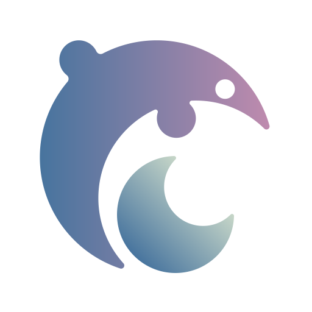

<p align="center"></p>

<div>
<h1 align="center">Dolphin</h1>
<p align="center">Dolphin is a fork of Misskey, but optimized for single user (or few users) use.</p>
<p align="center"><strong>UNDER DEVELOPMENT</strong></p>
</div>

## Install
### Install dependencies
Please install and setup these softwares:

* **[Node.js](https://nodejs.org/en/)** >= 11.7.0
* **[PostgreSQL](https://www.postgresql.org/)** >= 10
* **[Redis](https://redis.io/)**

### Install Dolphin

1. Clone the Dolphin repo

	`git clone -b master git://github.com/syuilo/dolphin.git`

2. Navigate to Dolphin directory

	`cd dolphin`

3. Install Dolphin dependencies.

	`npm i`

### Configure Dolphin
1. Copy the `.config/example.yml` and rename it to `default.yml`.

	`cp .config/example.yml .config/default.yml`

2. Edit `default.yml`

	e.g. `vim .config/default.yml`

### Build Dolphin
Build dolphin with the following:

`NODE_ENV=production npm run build`

<details>
<summary>If you're on Debian...</summary>
You will need to install the `build-essential`, `python` package.
</details>

<details>
<summary>If you're still encountering errors about some modules...</summary>
Use node-gyp:

1. `npx node-gyp configure`
2. `npx node-gyp build`
3. `NODE_ENV=production npm run build`
</details>

### Initialize database
``` shell
npm run init
```

That is it.

### Launch Dolphin
``` shell
NODE_ENV=production npm start
```

Enjoy!

## How to update your Dolphin
1. `git pull`
2. `npm i`
3. `NODE_ENV=production npm run build`
4. `npm run migrate`
5. Restart your Dolphin process to apply changes
6. Enjoy
